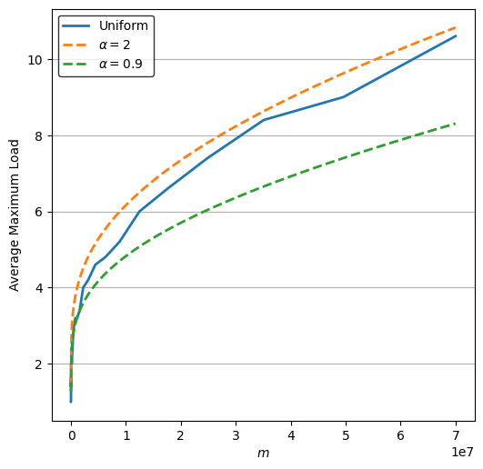
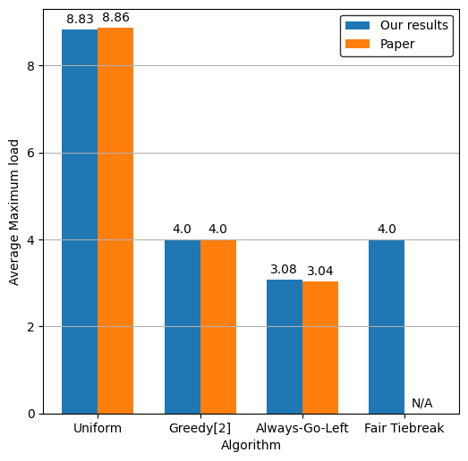
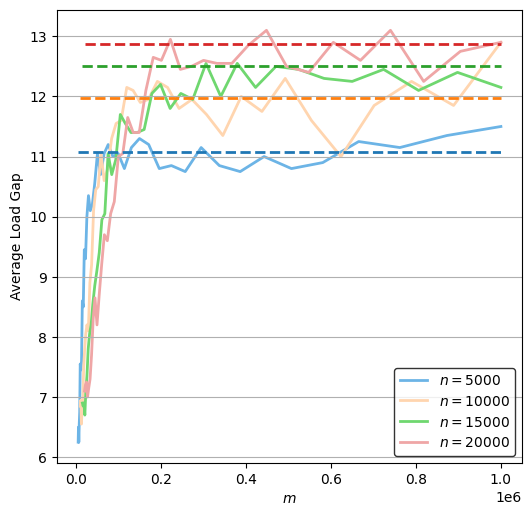
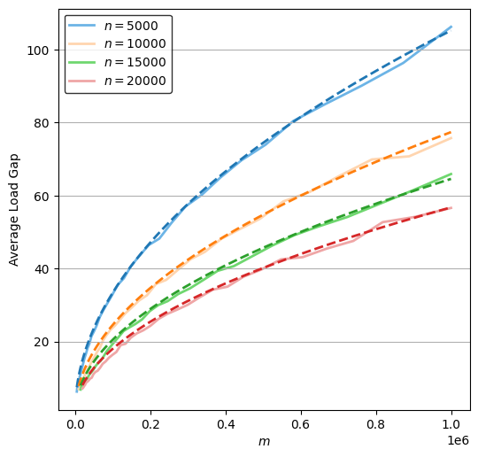
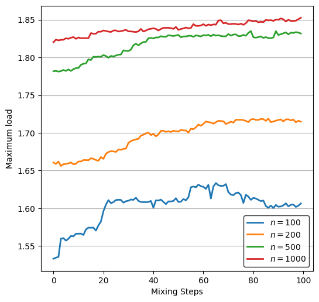

# A Software Package for Simulating and Visualising Load Balancing Algorithms

**This repository contains the source code for my Computer Science BSc Individual Project at Durham (graded 80/100)**

## Paper Abstract

A simple abstraction of load balancing systems is the balls into bins probability model, which can be modified to represent more load balancing scenarios. Performance analysis of algorithms used to allocate balls into bins is often complex and not intuitive. This project aims to create a software package to aid in collecting and analysing experimental data for various balls into bins algorithms. The package provides an easy-to-use API that can run simulations faster than equivalent plain Python code whilst reducing the implementation complexity required to run and parallelise experiments. Simulation results contain several metrics that are calculated after the experiments are run. These can be visualised in the provided Jupyter Notebook to compare and evaluate different algorithms. The software was able to replicate results seen in literature with minimal effort in order to deliver an experimentation focused survey of commonly cited balls into bins algorithms.

## Project Paper

The project paper which describes the scientific process can be found [here](report.pdf).

## Usage Notebook

Get started by running `pip install .`. Libraries used in the notebook need to be installed separately.

This Notebook provides a) example usage of the software package and b) the required code to recreate the paper's results. To begin using the software package, the `core` and `simulation` packages need to be imported.

In these examples, the API's classes from the `simulation` package are imported into the current namespace. The `core` package has been imported under the alias `lb` (for load balancer).


```python
import load_balancing.core as lb
from load_balancing.simulation import Simulation, ParallelSimulation, SimulationResult

# We can also import the suggested matplotlib style parameters
from load_balancing import mpl_style
from load_balancing.utils import available_cores
```

The following imports are used by the notebook to run and visualise the experiments.

* `matplotlib` is used to plot charts
* `numpy` is used for math functions and to generate distributions
* `tikzplotlib` is used to output plots to a .TeX file


```python
import matplotlib.colors
import matplotlib.pyplot as plt
import matplotlib.style

# Initialise matplotlib for Jupyter Notebook and set style parameters
%matplotlib inline
matplotlib.style.use(mpl_style)  # type: ignore

import colorsys
from dataclasses import asdict
from functools import partial

# Used for a custom multiprocessing implementation
from multiprocessing import Pool
from operator import itemgetter
from typing import Callable, List, Tuple

import numpy as np
import tikzplotlib
from IPython.display import Markdown, display
from tabulate import tabulate
```

A few helper functions are defined for use in the notebook.


```python
def fig_to_tex(fig, filename: str):
    """Save a Matplotlib Figure to a .TeX file

    :param fig: Figure that should be saved
    :type fig: plt.Figure
    :param filename: Name of file to save to
    :type filename: str
    """
    tikzplotlib.clean_figure(fig)
    tikzplotlib.save(filename, figure=fig)


def plot_attributes(
    results: List[SimulationResult], x: str = "m", y: str = "maximum_load"
) -> Tuple[Tuple, Tuple]:
    """Convert a list of SimulationResult to two lists for the given attributed.

    :param results: List of simulation results
    :type results: List[SimulationResult]
    :param x: Attribute to be returned as xs, defaults to "m"
    :type x: str, optional
    :param y: Attribute to be returned as ys, defaults to "maximum_load"
    :type y: str, optional
    :return: Tuple of xs, ys
    :rtype: Tuple[Tuple, Tuple]
    """
    xs, ys = zip(*[(getattr(result, x), getattr(result, y)) for result in results])
    return xs, ys


def plot_gap(results: List[SimulationResult], x: str = "m") -> Tuple[Tuple, Tuple]:
    """Convert a list of SimulationResult to two lists containing the gap between maximum and minimum load.
    Similar to the plot_attribute function.

    :param results: List of simulation results
    :type results: List[SimulationResult]
    :param x: Attribute to be returned as xs, defaults to "m"
    :type x: str, optional
    :return: Typle of xs, ys
    :rtype: Tuple[Tuple, Tuple]
    """
    xs, ys = zip(
        *[
            (getattr(result, x), result.maximum_load - result.minimum_load)
            for result in results
        ]
    )
    return xs, ys


def plot_function(min: float, max: float, f: Callable, num=1000) -> Tuple[List, List]:
    """Helper function to plot a function, useful to visualise bounds

    :param min: Value to plot from
    :type min: float
    :param max: Value to plot to
    :type max: float
    :param f: Function such that y = f(x)
    :type f: Callable
    :param num: Number of points, defaults to 1000
    :type num: int
    :return: Tuple of xs, ys
    :rtype: Tuple[List, List]
    """
    xs = list(np.linspace(min, max, num))
    ys = []
    for x in xs:
        ys.append(f(x))
    return xs, ys


def lighter(hex: str) -> Tuple[float, float, float]:
    """Return a lighter version of hex

    :param hex: Colour hex code
    :type hex: str
    :return: Lighter colour tuple
    :rtype: Tuple[float, float, float]
    """
    h, l, s = colorsys.rgb_to_hls(*matplotlib.colors.ColorConverter.to_rgb(hex))
    return colorsys.hls_to_rgb(h, min(1, l * 1.6), s=s)


def display_results_as_table(results: List[SimulationResult], head=False):
    """Display a list of SimulationResult as a table

    :param results: List of results
    :type results: List[SimulationResult]
    """
    if head:
        results = results[0:5]
        display(Markdown("Top 5 rows:"))
    display(
        tabulate(
            [asdict(result) for result in results], headers="keys", tablefmt="html"
        )
    )
```

### Describing the simple Greedy[d] algorithm.

To describe the `greedy[d]` algorithm, write the algorithm as a function using the `load_balancing.core` API.

Here we choose $d$ bins from the list of bins, and return the least loaded of the $d$| bins.


```python
def my_greedy_d(ball: lb.Ball, bins: lb.Bins, d: int):
    chosen_bins = bins.choose(d)
    return chosen_bins.min()
```

### Run a simulation

To run this as a simulation, pass the algorithm to the `Simulation` class and call it like a function. Make sure the number of balls $m$ and bins $n$ are provided. The `greedy[d]` parameter, $d$, is added to the end of the function arguments.

In this experiment we will simulate 100,000 balls and bins.


```python
my_greedy_d_sim = Simulation(my_greedy_d)

experiment_result = my_greedy_d_sim(100000, 100000, 2)

display_results_as_table([experiment_result])
```


<table>
<thead>
<tr><th style="text-align: right;">     m</th><th style="text-align: right;">     n</th><th style="text-align: right;">  maximum_load</th><th style="text-align: right;">  minimum_load</th><th style="text-align: right;">  std_load</th><th style="text-align: right;">  load_accesses</th></tr>
</thead>
<tbody>
<tr><td style="text-align: right;">100000</td><td style="text-align: right;">100000</td><td style="text-align: right;">             4</td><td style="text-align: right;">             0</td><td style="text-align: right;">  0.703264</td><td style="text-align: right;">         200000</td></tr>
</tbody>
</table>


### A more complicated algorithm

The `greedy[d]` algorithm is rather simple to describe and doesn't show the power of the simulation system. In the next cell we describe the `always-go-left` algorithm and run the same simulation.


```python
def my_always_go_left(ball: lb.Ball, bins: lb.Bins):
    left_bins, right_bins = bins.split(2)
    left_bin = left_bins.choose_one()
    right_bin = right_bins.choose_one()
    if left_bin.load <= right_bin.load:  # this is where the unfair tie-breaking is
        return left_bin
    else:
        return right_bin


my_always_go_left_sim = Simulation(my_always_go_left)

experiment_result = my_always_go_left_sim(100000, 100000)
display_results_as_table([experiment_result])
```


<table>
<thead>
<tr><th style="text-align: right;">     m</th><th style="text-align: right;">     n</th><th style="text-align: right;">  maximum_load</th><th style="text-align: right;">  minimum_load</th><th style="text-align: right;">  std_load</th><th style="text-align: right;">  load_accesses</th></tr>
</thead>
<tbody>
<tr><td style="text-align: right;">100000</td><td style="text-align: right;">100000</td><td style="text-align: right;">             3</td><td style="text-align: right;">             0</td><td style="text-align: right;">  0.684485</td><td style="text-align: right;">         200000</td></tr>
</tbody>
</table>


We can already see an improvement in the maximum load of any bin after this experiment.

## Paper Results

In this section we will use the simulation to recreate the results from the paper. An associated `algorithms.py` file will be used for the implementations. This is because the system requires functions to be defined in a Python file for parallelisation.


```python
from algorithms import (
    uniform,
    greedy_d,
    always_go_left,
    fair_tiebreak,
    one_plus_beta,
    threshold,
    adaptive,
)
```

The following flag can be set to True to run the larger experiments that were used in the paper. Otherwise, smaller experiments will be run to save time.


```python
USE_LARGE_NUMBERS = True
```

#### 4.1 Uniform Load Balancing

We will use the `ParallelSimulation` class to take advantage of the multicore processor. In this case it will be used with only one algorithm.

The warning is shown when the class is used in a notebook (like this one) and can be safely ignored since we are loading algorithms from a file.

```python
def uniform(ball: lb.Ball, bins: lb.Bins):
    """Select a bin at random"""
    return bins.choose_one()
```


```python
uniform_sim = ParallelSimulation((uniform, []))

low = 100
high = 70000100 if USE_LARGE_NUMBERS else 7000

experiment_results = uniform_sim.run(low, high, num=40, repeats=5)
uniform_result = experiment_results["uniform"]

display_results_as_table(uniform_result, head=True)
```

    Warning: Parallel Simulations may hang if functions are defined in interactive mode.
    Using 6 processes to run 40 jobs


      0%|          | 0/40 [00:00<?, ?it/s]


Top 5 rows:


<table>
<thead>
<tr><th style="text-align: right;">  m</th><th style="text-align: right;">       n</th><th style="text-align: right;">  maximum_load</th><th style="text-align: right;">  minimum_load</th><th style="text-align: right;">  std_load</th><th style="text-align: right;">  load_accesses</th></tr>
</thead>
<tbody>
<tr><td style="text-align: right;">100</td><td style="text-align: right;">70000100</td><td style="text-align: right;">             1</td><td style="text-align: right;">             0</td><td style="text-align: right;">0.00119523</td><td style="text-align: right;">              0</td></tr>
<tr><td style="text-align: right;">141</td><td style="text-align: right;">70000100</td><td style="text-align: right;">             1</td><td style="text-align: right;">             0</td><td style="text-align: right;">0.00141925</td><td style="text-align: right;">              0</td></tr>
<tr><td style="text-align: right;">199</td><td style="text-align: right;">70000100</td><td style="text-align: right;">             1</td><td style="text-align: right;">             0</td><td style="text-align: right;">0.00168607</td><td style="text-align: right;">              0</td></tr>
<tr><td style="text-align: right;">281</td><td style="text-align: right;">70000100</td><td style="text-align: right;">             1</td><td style="text-align: right;">             0</td><td style="text-align: right;">0.00200356</td><td style="text-align: right;">              0</td></tr>
<tr><td style="text-align: right;">397</td><td style="text-align: right;">70000100</td><td style="text-align: right;">             1</td><td style="text-align: right;">             0</td><td style="text-align: right;">0.00238147</td><td style="text-align: right;">              0</td></tr>
</tbody>
</table>


The following code shows how this data can be plotted on a chart using the library.

We will use the `plot_function` method to plot the bounds $\frac{\log n}{\log \frac{n \log n}{m}} \left( 1 + \alpha \frac{\log \log \frac{n \log n}{m}}{\log \frac{n \log n}{m}} \right)$ for different values of $\alpha$


```python
fig, ax = plt.subplots()
ax.set_xlabel("$m$")
ax.set_ylabel("Average Maximum Load")

# Plot the results
ax.plot(*plot_attributes(uniform_result), label="Uniform")

# Plot the bounds.
n = high


def uniform_bounds(a):
    logn = np.log(n)

    def func(m):
        lognlognoverm = np.log((n * logn) / m)
        return (logn / lognlognoverm) * (
            1 + a * (np.log(lognlognoverm) / lognlognoverm)
        )

    return func


ax.plot(
    *plot_function(low, high, uniform_bounds(2)), label="$\\alpha = 2$", linestyle="--"
)
ax.plot(
    *plot_function(low, high, uniform_bounds(0.9)),
    label="$\\alpha = 0.9$",
    linestyle="--"
)

# Enable the legend
ax.legend()

# Save to .TeX file
fig_to_tex(fig, "charts/uniform.tex")
```


    

    


#### 4.2 Always-Go-Left

This experiment will produce a bar chart that will be used to verify the results of the Always-Go-Left paper. The results aim to show how asymmetry in the tiebreaking algorithm decreases the average maximum load.

```python
def always_go_left(ball: lb.Ball, bins: lb.Bins):
    """Divide the bins into two halves, and choose a random bin from each. Select the lowest loaded. Tiebreaks: Choose left."""
    left_bins, right_bins = bins.split(2)
    left_bin = left_bins.choose_one()
    right_bin = right_bins.choose_one()
    if left_bin.load <= right_bin.load:
        return left_bin
    else:
        return right_bin

def fair_tiebreak(ball: lb.Ball, bins: lb.Bins):
    """Divide the bins into two halves, and choose a random bin from each. Select the lowest loaded. Tiebreaks: Fair."""
    left_bins, right_bins = bins.split(2)
    left_bin = left_bins.choose_one()
    right_bin = right_bins.choose_one()
    if left_bin.load < right_bin.load:
        return left_bin
    elif left_bin.load > right_bin.load:
        return right_bin
    else:
        if lb.probability(0.5):
            return left_bin
        else:
            return right_bin
```


```python
parallel_simulation = ParallelSimulation(
    (uniform, []), (greedy_d, [2]), (always_go_left, []), (fair_tiebreak, [])
)

# 2^20 if USE_LARGE_NUMBERS else 2^12
m = n = 1048576 if USE_LARGE_NUMBERS else 4096

experiment_results = parallel_simulation(m, n, repeats=100)
```

    Warning: Parallel Simulations may hang if functions are defined in interactive mode.
    Using 4 processes to run 4 jobs


      0%|          | 0/4 [00:00<?, ?it/s]


```python
fig, ax = plt.subplots()
ax.set_xlabel("Algorithm")
ax.set_ylabel("Average Maximum load")


def get_maximum_loads(results):
    return [algoritm_results[0].maximum_load for algoritm_results in results.values()]


# Plot the results
labels = ["Uniform", "Greedy[2]", "Always-Go-Left", "Fair Tiebreak"]

x = np.arange(len(labels))
width = 0.35  # Width of the bars

paper_results = [8.86, 4, 3.04, 0] if USE_LARGE_NUMBERS else [6.16, 3.01, 3, 0]

ours = ax.bar(
    x - width / 2, get_maximum_loads(experiment_results), width, label="Our results"
)
paper = ax.bar(x + width / 2, paper_results, width, label="Paper")

# Set the labels
ax.set_xticks(x, labels)

# Enable values on top of the bars
ax.bar_label(ours, [bar.get_height() or "N/A" for bar in ours], padding=3)
ax.bar_label(paper, [bar.get_height() or "N/A" for bar in paper], padding=3)

# Enable the legend
ax.legend()

# Save to .TeX file
fig_to_tex(fig, "charts/always_go_left.tex")
```

    /Users/danielstone/.pyenv/versions/3.10.2/lib/python3.10/site-packages/tikzplotlib/_cleanfigure.py:200: UserWarning: Cleaning Bar Container (bar plot) is not supported yet.
      warnings.warn("Cleaning Bar Container (bar plot) is not supported yet.")


    

    


#### 4.3 Distributed Algorithms

In this section, the `greedy[2]` and `uniform` algorithms will be evaluated in a distributed scenario. The corresponding paper states that for the `greedy[2]` algorithm, the expected largest gap between maximum and minimum load of any bin is $\mathcal{O}(\log n)$. For the `uniform` algorithm it is proven to be $\Theta (\sqrt{\frac{m \log n}{n}})$.

Constants will be found so that the experimental data is tightly bounded.

This experiment runs for varying values of n.


```python
experiment_results = {}

high = 1000000
repeats = 20 if USE_LARGE_NUMBERS else 5

for n in [5000, 10000, 15000, 20000]:
    display(Markdown(f"**Running for n = {n}**"))
    parallel_simulation = ParallelSimulation((uniform, []), (greedy_d, [2]))
    experiment_results[n] = parallel_simulation.run(
        n + 1, high, num=40, repeats=repeats, bins=n, balancers=n
    )
```


**Running for n = 5000**


    Warning: Parallel Simulations may hang if functions are defined in interactive mode.
    Using 6 processes to run 80 jobs


      0%|          | 0/80 [00:00<?, ?it/s]


**Running for n = 10000**


    Warning: Parallel Simulations may hang if functions are defined in interactive mode.
    Using 6 processes to run 80 jobs


      0%|          | 0/80 [00:00<?, ?it/s]


**Running for n = 15000**


    Warning: Parallel Simulations may hang if functions are defined in interactive mode.
    Using 6 processes to run 80 jobs


      0%|          | 0/80 [00:00<?, ?it/s]


**Running for n = 20000**


    Warning: Parallel Simulations may hang if functions are defined in interactive mode.
    Using 6 processes to run 80 jobs


      0%|          | 0/80 [00:00<?, ?it/s]


```python
fig, ax = plt.subplots()
ax.set_xlabel("$m$")
ax.set_ylabel("Average Load Gap")

# Plot the bounds.
def distributed_greedy_d_bounds(n):
    logn = np.log(n)

    def func(m):
        return 1.3 * logn

    return func


for n, results in experiment_results.items():
    # Plot the bound in the default colour
    greedy_line = ax.plot(
        *plot_function(n, high, distributed_greedy_d_bounds(n)),
        linestyle="--",
        zorder=2,
    )[0]
    # Plot the data in a lighter colour
    ax.plot(
        *plot_gap(results["greedy_d_2"]),
        label=f"$n = {n}$",
        color=lighter(greedy_line.get_color()),
        zorder=1,
    )

# Enable the legend
ax.legend()

# Save to .TeX file
fig_to_tex(fig, "charts/distributed_greedy.tex")
```


    

    


```python
fig, ax = plt.subplots()
ax.set_xlabel("$m$")
ax.set_ylabel("Average Load Gap")

# Plot the bounds.
def distributed_uniform_bounds(n):
    logn = np.log(n)

    def func(m):
        return 2.55 * np.sqrt(m * logn / n)

    return func


for n, results in experiment_results.items():
    # Plot the bound in the default colour
    greedy_line = ax.plot(
        *plot_function(n, high, distributed_uniform_bounds(n)), linestyle="--", zorder=2
    )[0]
    # Plot the data in a lighter colour
    ax.plot(
        *plot_gap(results["uniform"]),
        label=f"$n = {n}$",
        color=lighter(greedy_line.get_color()),
        zorder=1,
    )

# Enable the legend
ax.legend()

# Save to .TeX file
fig_to_tex(fig, "charts/distributed_uniform.tex")
```


    

    


#### 4.4 Weighted Balls

This experiment on `greedy[2]` analyses the average maximum load for a sorted weight distribution as it becomes less sorted.


```python
from sorting_steps import sorting_steps

steps = [100, 200, 500, 1000]

repeats = 10000 if USE_LARGE_NUMBERS else 100

cpu_count = min(len(steps), available_cores())
print(f"Using {cpu_count} processes")

with Pool(cpu_count) as p:
    experiment_results = p.map(partial(sorting_steps, repeats), steps)
```

    Using 4 processes
    Number of balls and bins:  100
    Number of balls and bins:  200
    Number of balls and bins:  500
    Number of balls and bins:  1000


```python
fig, ax = plt.subplots()
ax.set_xlabel("Mixing Steps")
ax.set_ylabel("Maximum load")

for i, result in enumerate(experiment_results):
    ax.plot(*plot_attributes(result, x="mixing_steps"), label=f"$n = {steps[i]}$")

# Enable the legend
ax.legend()

# Save to .TeX file
fig_to_tex(fig, "charts/weighted.tex")
```


    

    


#### 4.4 Communication Complexity

This experiment will compare the communication complexity of the previously seen algorithms, with the `one_plus_beta`, `threshold` and `adaptive` algorithms.

```python

def one_plus_beta(ball: lb.Ball, bins: lb.Bins, p: float):
    """With probability p choose two bins, otherwise choose one at random"""
    if lb.probability(p):
        return bins.choose(2).min()
    else:
        return bins.choose_one()


def threshold(ball: lb.Ball, bins: lb.Bins):
    threshold = ball.m / bins.n + 1
    while True:
        chosen_bin = bins.choose_one()
        if chosen_bin.load < threshold:
            return chosen_bin


def adaptive(ball: lb.Ball, bins: lb.Bins):
    n = bins.n
    while True:
        chosen_bin = bins.choose_one()
        if chosen_bin.load < ball.position / n + 1:
            return chosen_bin
```


```python
communication_complexity_simulation = ParallelSimulation(
    (uniform, []),
    (greedy_d, [2]),
    (one_plus_beta, [0.5]),
    (threshold, []),
    (adaptive, []),
)

# 2^20 if USE_LARGE_NUMBERS else 2^12
m = n = 1048576 if USE_LARGE_NUMBERS else 4096

results = communication_complexity_simulation(m, n, repeats=100)
```

    Warning: Parallel Simulations may hang if functions are defined in interactive mode.
    Using 5 processes to run 5 jobs


      0%|          | 0/5 [00:00<?, ?it/s]


```python
sorted_results = sorted(
    [
        {
            "Algorithm": name,
            "Maximum Load": result[0].maximum_load,
            "Load Access Count": result[0].load_accesses,
        }
        for name, result in results.items()
    ],
    key=itemgetter("Maximum Load"),
    reverse=True,
)

display(tabulate(sorted_results, headers="keys", tablefmt="html"))
```


<table>
<thead>
<tr><th>Algorithm        </th><th style="text-align: right;">  Maximum Load</th><th style="text-align: right;">  Load Access Count</th></tr>
</thead>
<tbody>
<tr><td>uniform          </td><td style="text-align: right;">          8.75</td><td style="text-align: right;">                  0</td></tr>
<tr><td>one_plus_beta_0.5</td><td style="text-align: right;">          7.05</td><td style="text-align: right;">            1048480</td></tr>
<tr><td>greedy_d_2       </td><td style="text-align: right;">          4   </td><td style="text-align: right;">            2097152</td></tr>
<tr><td>threshold        </td><td style="text-align: right;">          2   </td><td style="text-align: right;">            1201901</td></tr>
<tr><td>adaptive         </td><td style="text-align: right;">          2   </td><td style="text-align: right;">            1201912</td></tr>
</tbody>
</table>

## References (including those cited in the corresponding paper)

* Afzal, S. & Kavitha, G. (2019) Load balancing in cloud computing–A hierarchical taxonomical classification. Journal of Cloud Computing, 8, 1-24.


* AmazonWebServices How Elastic Load Balancing works. 


* Angluin, D. et al. (2006) Computation in networks of passively mobile finite-state sensors. Distributed computing, 18, 235-253.


* Azar, Y. et al. (1994) Balanced allocations. Proceedings of the twenty-sixth annual ACM symposium on theory of computing, 593-602.


* Behnel, S. et al. (2010) Cython: The best of both worlds. Computing in Science and Engineering, 13, 31-39.


* Berenbrink, P. et al. (2008) On weighted balls-into-bins games. Theoretical Computer Science, 409, 511-520.


* Berenbrink, P. et al. (2012) Multiple-choice balanced allocation in (almost) parallel. In Approximation, Randomization, and Combinatorial Optimization. Algorithms and Techniques, Springer, pp. 411-422.


* Berenbrink, P. et al. (2013) Balls-into-bins with nearly optimal load distribution. Proceedings of the twenty-fifth annual ACM symposium on Parallelism in algorithms and architectures, 326-335.


* Chaczko, Z. et al. (2011) Availability and load balancing in cloud computing. International Conference on Computer and Software Modeling, Singapore 14, 134-140.


* Cole, R. et al. (1998) On balls and bins with deletions. International Workshop on Randomization and Approximation Techniques in Computer Science, 145-158.


* Czumaj, A. & Stemann, V. (2001) Randomized allocation processes. Random Structures and Algorithms, 18, 297-331.


* Doty, D. & Severson, E. (2021) ppsim: A software package for efficiently simulating and visualizing population protocols. International Conference on Computational Methods in Systems Biology, 245-253.


* Feuersänger, C. (2011) Manual for Package pgfplots. 17, 


* Fischer, S. & Vöcking, B. (2009) Adaptive routing with stale information. Theoretical Computer Science, 410, 3357-3371.


* Gonnet, G.H. (1981) Expected length of the longest probe sequence in hash code searching. Journal of the ACM (JACM), 28, 289-304.


* Harris, C.R. et al. (2020) Array programming with NumPy. Nature, 585, 357-362.


* Hunter, J.D. (2007) Matplotlib: A 2D graphics environment. Computing in science and engineering, 9, 90-95.


* Kluyver, T. et al. (2016) Jupyter Notebooks-a publishing format for reproducible computational workflows. 


* Lam, S.K., Pitrou, A. & Seibert, S. (2015) Numba: A llvm-based python jit compiler. Proceedings of the Second Workshop on …, 


* LLVM The LLVM Compiler Infrastructure - Users. 


* Los, D. & Sauerwald, T. (2022) Balanced Allocations in Batches: Simplified and Generalized. arXiv preprint arXiv:2203.13902, 


* Mitzenmacher, M. (2001) The power of two choices in randomized load balancing. IEEE Transactions on Parallel and …, 


* Peres, Y., Talwar, K. & Wieder, U. (2010) The (1+ Beta)-choice process and weighted balls-into-bins. Proceedings of the twenty-first annual ACM …, 


* Raab, M. & Steger, A. (1998) “Balls into bins”—A simple and tight analysis. International Workshop on Randomization and Approximation Techniques in Computer Science, 159-170.


* Scheibler, R., Bezzam, E. & Dokmanić, I. (2018) Pyroomacoustics: A python package for audio room simulation and array processing algorithms. 2018 IEEE International Conference on Acoustics, Speech and Signal Processing, 351-355.


* Talwar, K. & Wieder, U. (2007) Balanced allocations: the weighted case. Proceedings of the thirty-ninth annual ACM symposium on Theory of computing, 256-265.


* Vöcking, B. (2003) How asymmetry helps load balancing. Journal of the ACM (JACM), 50, 568-589.
